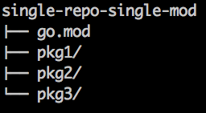
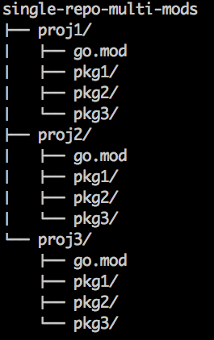

#### 引入

解决包依赖问题，是现代编程语言必备的特性。

包依赖的两个核心问题：

1. 包路径。
2. 包版本。

#### 模块（module）

`module` 是 go 在 1.11 后引入的概念，考虑到兼容性问题，go 根据环境变量 `GO111MODULE` 的值采取不同的处理方式：

* auto 自动模式下，项目在 `$GOPATH/src` 里会使用 `$GOPATH/src` 的依赖包，在 `$GOPATH/src` 外，就使用go.mod 里 require 的包。
* on 开启模式（module-aware mode），**1.12 **后，无论在 `$GOPATH/src` 里还是在外面，都会使用 go.mod 里 require 的包。
* off 关闭模式，默认查找vendor和GOPATH目录。

##### 模块名

模块名并没有特定的要求，但是如果要发布出去供别人下载使用的话，还是有一定限制的。

以 beego 为例：

 `module github.com/astaxie/beego`

引入相关模块下的包时，必须以模块名作为前缀，即使是同一个模块下的包之间相互引用时也是如此。

##### 使用模块

Go 模块的工作流:

`go mod init` 创建一个新模块，会初始化一个 go.mod 并有其描述.
`go build`, `go test`, 以及其他包生成命令根据需要向 go.mod 添加新的依赖项.
`go list -m all` 打印当前模块的依赖.
`go get` 更改依赖项的所需版本 (或添加一个新的依赖项).
`go mod tidy` 移除未使用的依赖.

参考：

https://juejin.im/post/5c9c8c4fe51d450bc9547ba1

https://learnku.com/docs/go-blog/using-go-modules

##### repo 下的 single mod 和  multi mode

#### 包

##### 导入

使用 `import` 导入包时，有两种导入方式：

1. 全路径导入（从 `GOPATH/src/ ` 后开始计算，使用 `/ ` 进行路径分隔）
2. 相对路径导入

##### init

一个包可以有多个 init 函数，包加载时会执行全部的 init 函数，但并不能保证执行顺序，所以不建议在一个包中放入多个 init 函数，将需要初始化的逻辑放到一个 init 函数里面。

init() 函数的特性如下：

- 每个源码可以使用 1 个 init() 函数。
- init() 函数会在程序执行前（main() 函数执行前）被自动调用。
- 调用顺序为 main() 中引用的包，以深度优先顺序初始化。

例如，假设有这样的包引用关系：main→A→B→C，那么这些包的 init() 函数调用顺序为：

C.init→B.init→A.init→main

此外，包的重复引用是允许的，比如包 a 引用了包 b 和包 c，包 b 和包 c 都引用了包 d。这种场景相当于重复引用了 d，这种情况是允许的，并且 Go 编译器保证包 d 的 init 函数只会执行一次。

##### 其它

Go语言包的初始化有如下特点：

- 包初始化程序从 main 函数引用的包开始，逐级查找包的引用，直到找到没有引用其他包的包，最终生成一个包引用的有向无环图。
- Go 编译器会将有向无环图转换为一棵树，然后从树的叶子节点开始逐层向上对包进行初始化。
- 单个包的初始化过程如上图所示，先初始化常量，然后是全局变量，最后执行包的 init 函数。

